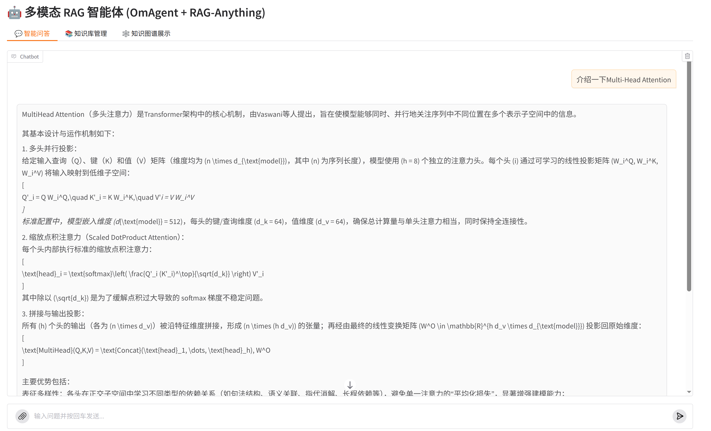
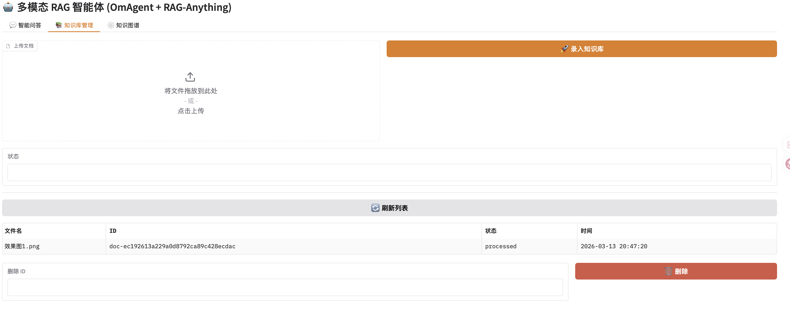
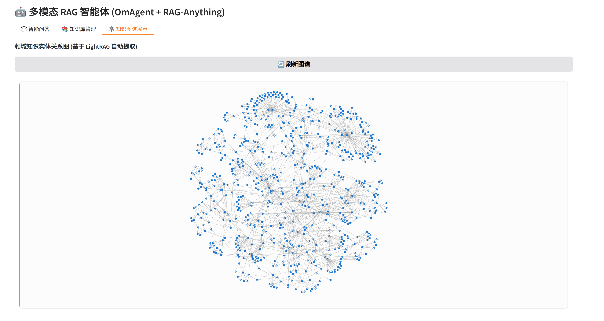

# 🤖 Multimodal Graph-RAG Agent (基于 OmAgent + RAG-Anything)

<p align="center">
  
  
  
  
  
</p>

本项目是一个融合了**多模态感知 (Vision)**、**知识图谱 (Graph RAG)** 与 **工业级向量检索 (Vector RAG)** 的下一代智能体系统。它能够“看懂”复杂的 PDF 文档（含图表），自动构建底层语义图谱，并支持用户通过“文字+图片”的混合方式进行高维度的专业逻辑问答。

---

## 🌟 核心特性

- **🚀 多模型智能路由 (Powered by Litellm)**：
  - 彻底解除平台绑定，**聊天、图谱抽取、视觉解析、向量嵌入**四大任务均可独立配置不同厂商的模型（OpenAI/Claude/DeepSeek/Qwen/本地模型等），实现成本与性能的极致平衡。
- **🔍 双引擎混合检索 (`Mix` Mode)**：
  - **Graph RAG**: 基于实体关系网的深层逻辑推理。
  - **Vector RAG**: 基于 FAISS 的高精度语义匹配，且**支持启动时自动探测 Embedding 维度**。
- **📸 真正多模态交互**：
  - 支持上传截图提问，自动识别图中 Logo、趋势及含义并结合图谱库回答。
- **📊 交互式知识图谱可视化**：
  - 内置基于 `vis-network` 的动态 3D 渲染界面，实时展示知识间的拓扑关联。
- **⚡ 极致工程优化**：
  - **全异步流水线**: 彻底解决 Python 异步死锁导致的 UI 挂起。
  - **轻量级运行**: 无需复杂服务器，单机环境 + `lite` 模式即可跑通全流程。

---

## 🛠️ 技术架构

| 模块 | 技术选型 |
| :--- | :--- |
| **智能体框架** | OmAgent (Workflows & Workers) |
| **RAG 引擎** | RAG-Anything (Powered by LightRAG) |
| **模型网关** | Litellm (Any Model, Standard API) |
| **向量库** | FAISS (purely local & auto-dimension) |
| **多模态解析** | MinerU (Magic-PDF) |
| **Web 界面** | Gradio (Custom Multitab UI) |

---

## 🚀 快速开始

### 1. 环境安装
```bash
conda create -n multi-agent python=3.11 -y
conda activate multi-agent
pip install -r requirements.txt
```

### 2. 配置 API Key
支持使用 `.env` 文件或在终端 `export` 环境变量。您可以参考 `omagent/examples/rag_multimodal_agent/.env.example` 进行配置。

借助 Litellm，您可以自由组合模型（例如用 Qwen 聊天，用 DeepSeek 抽取）：
```bash
# 示例：直接在终端 export (或写入 .env 文件)
export CHAT_MODEL_ID=openai/qwen-plus
export CHAT_API_KEY=your_dashscope_key
export EMBED_DIM=0  # 开启自适应维度探测
```

### 3. 启动项目
```bash
cd omagent/examples/rag_multimodal_agent
python run_webpage.py
```

---

## 📸 界面预览

| 💬 智能问答 | 📚 知识库管理 | 🕸️ 知识图谱展示 |
| :---: | :---: | :---: |
|  |  |  |

---

## 🧗‍♂️ 项目难点与攻克记录
在整合 OmAgent、LightRAG 与 Litellm 的过程中，我们解决了包括 **Python 异步锁跨线程死锁**、**动态 Embedding 维度探测**、**API 兼容性清洗** 等多个隐蔽的底层架构冲突。

---

## 🤝 贡献与感谢

本项目基于以下优秀的开源项目重构而成：
- [OmAgent](https://github.com/omagent-io/omagent): 灵活的多模态智能体框架。
- [RAG-Anything](https://github.com/Bob-Zheng/rag-anything): 全能多模态 RAG 工具。
- [LightRAG](https://github.com/HKU-Smart-AILab/LightRAG): 极致的图谱 RAG 算法。
- [Litellm](https://github.com/BerriAI/litellm): 调用所有 LLM API 的统一网关。

---
<p align="center">Made with ❤️ for Multimodal AI Enthusiasts</p>
